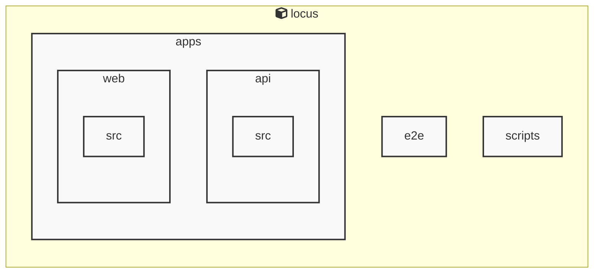

# AGENTS ドキュメント

自動生成日時: 2025-12-31 14:48:08

このドキュメントは、AIコーディングエージェントがプロジェクト内で効果的に作業するための指示とコンテキストを提供します。

---


<!-- MANUAL_START:description -->
Locus は、Markdown ノートと RSS フィードを一つのローカルに保持した知識ベースへ統合し、双方向リンクで相互参照できるパーソナルナレッジシステムです。
ユーザーは自分専用のノートを書き込みながら、インターネット上の情報をリアルタイムに取り込むことができます。また、全てのデータはローカルファイル（Markdown とメタデータ）として保存されるため、クラウドへの依存やプライバシーリスクを排除しつつ高速な検索とオフライン利用を実現します。
<!-- MANUAL_END:description -->

Locus は「ローカルファースト」設計の個人知識管理システムで、Markdown ノートと RSS フィードを同一ディレクトリ構造に統合し、双方向リンク機能によってノート間の関係性を可視化します。  
- **ローカル保存**：すべてのデータ（テキスト・メタ情報・バックアップ）はユーザー側ファイルシステム上に格納されるため、クラウド同期や API キーは不要です。  
- **Markdown 解析**：TypeScript と Node.js をベースとし、`cheerio@^1.1.2` により Markdown 内の HTML 埋め込みをパースしてリンク先・メタデータ抽出が可能。Frontmatter はオプションで利用でき、ノート作成時に自動的にタグ付けや日付管理も行えます。  
- **RSS フィード統合**：`jszip@^3.10.1` を活用し、指定した RSS URL から最新記事を取得・パースして「Feed」フォルダ内の Markdown ファイルとして保存します。ユーザーは単一ビューでノートとフィード項目を横断検索できます。  
- **双方向リンク**：Markdown 内に `[[note-title]]` の形式で書かれた参照が自動的に逆向きにも登録され、知識グラフとして可視化（CLI もしくは Web UI）可能です。これによりノート間の関連性を直感的に把握できます。  
- **バックアップと復元**：`jszip` を利用した ZIP 圧縮/解凍スクリプトで、ディレクトリ全体を簡単にアーカイブ・移行できる CLI コマンドが用意されています。  

開発言語は TypeScript / JavaScript（Node.js）とシェルスクリプトの組み合わせで構成されており、`npm` を通じたパッケージ管理により依存関係を一元化しています。Locus はオフライン環境下でも高速かつ安全な知識蓄積・検索体験を提供し、個人の情報整理ワークフローを大幅に効率化します。
**使用技術**: typescript, javascript, shell
## プロジェクト構造
```
├── apps//
│   ├── api//
│   │   ├── package.json
│   │   └── tsconfig.json
│   └── web//
│       ├── package.json
│       └── tsconfig.json
├── docs/
├── packages//
│   └── shared//
│       ├── package.json
│       └── tsconfig.json
├── scripts/
├── AGENTS.md
├── README.md
├── biome.json
├── package.json
├── pyproject.toml
└── tsconfig.json
```
## アーキテクチャ

<!-- MANUAL_START:architecture -->

<!-- MANUAL_END:architecture -->


## Services

### locus
- **Type**: typescript
- **Description**: Locus is a local-first personal knowledge system that integrates Markdown notes, RSS feeds, and bidirectional links into a unified knowledge space.
- **Dependencies**: @biomejs/biome, @libsql/client, @playwright/test, @types/bun, @types/cheerio, @types/jszip, cheerio, jszip

---

## 開発環境のセットアップ

<!-- MANUAL_START:setup -->

<!-- MANUAL_END:setup -->
### 前提条件
- Node.js 18以上

### 依存関係のインストール
#### TypeScript依存関係

```bash
npm install
```

### LLM環境のセットアップ
#### ローカルLLMを使用する場合

1. **ローカルLLMのインストール**

   - Ollamaをインストール: https://ollama.ai/
   - モデルをダウンロード: `ollama pull llama3`
   - サービスを起動: `ollama serve`

2. **ローカルLLM使用時の注意事項**
   - モデルが起動していることを確認してください
   - ローカルリソース（メモリ、CPU）を監視してください

---


## ビルドおよびテスト手順

### ビルド手順
```bash
npm run lint
npm run lint:fix
npm run format
npm run format:check
npm run check
# ... その他のコマンド
```

### テスト実行
```bash
npm test
```
## コマンド

プロジェクトで利用可能なスクリプト:

| コマンド | 説明 |
| --- | --- |
| `lint` | biome lint . |
| `lint:fix` | biome lint --write . |
| `format` | biome format --write . |
| `format:check` | biome format . |
| `check` | biome check . |
| `check:fix` | biome check --write . |
| `migrate` | bun run scripts/migrate.ts |
| `deploy:public-site` | bun run scripts/deploy-public-site.ts |
| `dev:api` | bun run apps/api/src/server.ts |
| `dev:web` | bun --cwd=apps/web run dev |
| `dev` | bunx concurrently --names 'API,WEB' --prefix-colors 'blue,green' 'bun run dev:api' 'bun run dev:web' |
| `test` | bun test apps packages |
| `test:api` | bun --cwd=apps/api test |
| `test:web` | bun --cwd=apps/web test |
| `test:coverage` | bun test --coverage apps/api/src apps/web/src |
| `test:coverage:api` | bun test --coverage apps/api/src |
| `test:coverage:web` | bun test --coverage apps/web/src |
| `test:e2e` | playwright test |
| `test:e2e:ui` | bash scripts/test-e2e-ui.sh |
---

## コーディング規約

<!-- MANUAL_START:other -->

<!-- MANUAL_END:other -->

---

## プルリクエストの手順

<!-- MANUAL_START:pr -->

<!-- MANUAL_END:pr -->
1. **ブランチの作成**
   ```bash
   git checkout -b feature/your-feature-name
   ```

2. **変更のコミット**
   - コミットメッセージは明確で説明的に
   - 関連するIssue番号を含める

3. **テストの実行**
   ```bash
   npm test
   ```

4. **プルリクエストの作成**
   - タイトル: `[種類] 簡潔な説明`
   - 説明: 変更内容、テスト結果、関連Issueを記載

---

*このAGENTS.mdは自動生成されています。最終更新: 2025-12-31 14:48:08*