# AGENTS ドキュメント

自動生成日時: 2026-01-01 05:55:09

このドキュメントは、AIコーディングエージェントがプロジェクト内で効果的に作業するための指示とコンテキストを提供します。

---


<!-- MANUAL_START:description -->
Locus は、Markdown ノートと RSS フィードを一つのローカルに保持した知識ベースへ統合し、双方向リンクで相互参照できるパーソナルナレッジシステムです。
ユーザーは自分専用のノートを書き込みながら、インターネット上の情報をリアルタイムに取り込むことができます。また、全てのデータはローカルファイル（Markdown とメタデータ）として保存されるため、クラウドへの依存やプライバシーリスクを排除しつつ高速な検索とオフライン利用を実現します。
<!-- MANUAL_END:description -->

Locus は「ローカルファースト」のパーソナル知識管理システムで、Markdown 形式のノートと RSS フィードを統合し、双方向リンクによって一貫したナレッジグラフへ変換します。  
主な設計思想は次の三点です。

1. **プライバシー重視** – 全てのデータはローカルに保存され、外部サーバへのアップロードは行いません。  
2. **拡張性と統一感** – Markdown の柔軟な表現力をベースにしつつ、RSS で得た情報も同じリンク構造へ取り込むことで知識の断片が自然に結び付きます。  
3. **双方向リンクによる可視化** – `[[ページ名]]` のようなノート内リンクを自動解析し、逆参照テーブル（どこからこのノードへのリンクがあるか）も生成します。

## アーキテクチャ

| コンポーネント | 役割 |
|-----------------|------|
| **ファイルシステム** | Markdown ファイル (`.md`) とメタデータ (YAML front‑matter) を格納。ローカルディレクトリ構造は自由に設定可能（例：`notes/2024-01.md`）。 |
| **RSS インポーター** | `cheerio@^1.1.2` で HTML パース、記事タイトル・本文を Markdown 化し指定フォルダへ保存。URL を元に重複チェックも行う。 |
| **リンク解析エンジン** | ファイル全体をスキャンして [[ページ]] の参照を抽出、双方向マップ（ノード ↔︎ 逆参照）をメモリ上で構築。必要時 `jszip@^3.10.1` を使って ZIP 圧縮・解凍もサポート。 |
| **CLI & API** | TypeScript/Node.js のスクリプトとして提供され、以下のコマンドを備える：<br>`locus add <title> [content]` – 新規ノード作成<br>`locus import-rss <feedUrl> --dest notes/rss` – RSS フィード取り込み<br>`locus search "<query>"` – 文字列検索（リンク解析結果も返す）<br>外部アプリやエージェントは `node_modules/locus/dist/index.js` の関数を呼び出して操作できる。 |
| **データベース** | 本来の設計では SQLite 等は使用せず、ファイルシステムとメモリ上で構築したグラフのみで完結する。必要に応じて `lowdb` など軽量 JSON DB を追加可能。 |

## 主な機能

- **Markdown ノート管理** – タイトル・タグ付け（YAML front‑matter）と本文を分離し、検索性向上。
- **RSS フィードの自動変換** – 最新記事を定期的に取得して Markdown 化。重複チェックで同一コンテンツは除外される。
- **双方向リンク解析** – `[[ノート名]]` 形式の参照だけでなく、URL やファイルパスも自動検出し逆参照を生成することで「どこからこの情報が引用されたか」を追跡できる。
- **ローカルバックアップ/復元** – `jszip@^3.10.1` を利用してノート全体の ZIP 圧縮・解凍機能。Git などでバージョン管理しやすい構造になっている。

## エージェント向けインターフェース

| API | 説明 |
|-----|------|
| `addNote(title: string, content?: string)` | 新規ノートを作成。`content` が省略されると空テンプレートが生成され、ユーザーは後から編集可能。 |
| `importRSS(feedUrl: string): Promise<RSSImportResult>` | RSS フィードを取得し Markdown に変換して保存する非同期関数。結果にはインポートされた記事数・重複回避情報などが含まれる。 |
| `search(query: string, options?: SearchOptions)` | キーワード検索で一致したノートとそのリンク先/逆参照を返す。`options.includeLinks=true` でリンク構造も一緒に取得可能。 |
| `getGraph(): GraphData` | 現在の双方向リンクグラフ（ノード・エッジ）を JSON 形式で提供し、可視化ツールや推論エンジンへ渡せる。 |

## 開発者向けヒント

- **カスタムプラグイン** – `locus` コマンドに対して独自のサブコマンドを追加することで、新しいデータソース（API、ファイル形式）からノートへの取り込みも簡単。
- **テスト環境** – Jest で CLI の動作確認が可能。例：`locus import-rss https://example.com/feed.xml --dest test/rss`
- **CI/CD パイプライン** – GitHub Actions などで `npm run lint && npm test` を走らせ、ローカルデータベースの整合性チェックを自動化。

Locus はノート作成と情報収集が自然に結び付くよう設計されており、AI エージェントは上記 API で知識取得・検索・更新を行い、自律的な学習ループやナレッジベース構築の中核として活用できます。
**使用技術**: typescript, javascript, shell
## プロジェクト構造
```
├── apps//
│   ├── api//
│   │   ├── src//
│   │   │   ├── index.ts
│   │   │   └── server.ts
│   │   ├── package.json
│   │   └── tsconfig.json
│   └── web//
│       ├── src//
│       │   └── app.d.ts
│       ├── static//
│       │   └── sw.js
│       ├── package.json
│       ├── svelte.config.js
│       ├── tsconfig.json
│       └── vite.config.ts
├── docs/
├── e2e//
│   ├── helpers.ts
│   ├── links.spec.ts
│   ├── notes.spec.ts
│   ├── rss.spec.ts
│   ├── search.spec.ts
│   └── tags.spec.ts
├── packages//
│   └── shared//
│       ├── src//
│       │   └── index.ts
│       ├── package.json
│       └── tsconfig.json
├── scripts/
├── AGENTS.md
├── README.md
├── biome.json
├── package.json
├── playwright.config.ts
├── pyproject.toml
└── tsconfig.json
```
## アーキテクチャ

<!-- MANUAL_START:architecture -->

<!-- MANUAL_END:architecture -->


```mermaid
graph TB
    %% Auto-generated architecture diagram

    subgraph locus [fa:fa-cube locus]
        direction TB
        subgraph at_locus_api [&#64;locus/api]
            direction TB
            subgraph at_locus_api_src [src]
                direction TB
                subgraph at_locus_api_src_db [db]
                    direction TB
                    at_locus_api_src_db_utils["utils"]:::moduleStyle
                end
                class at_locus_api_src_db moduleStyle
                at_locus_api_src_utils["utils"]:::moduleStyle
                at_locus_api_src_middleware["middleware"]:::moduleStyle
                at_locus_api_src_routes["routes"]:::moduleStyle
                subgraph at_locus_api_src_services [services]
                    direction TB
                    at_locus_api_src_services_utils["utils"]:::moduleStyle
                    at_locus_api_src_services_export["export"]:::moduleStyle
                    at_locus_api_src_services_llm["llm"]:::moduleStyle
                end
                class at_locus_api_src_services moduleStyle
            end
            class at_locus_api_src moduleStyle
        end
        class at_locus_api moduleStyle
        subgraph at_locus_web [&#64;locus/web]
            direction TB
            subgraph at_locus_web_src [src]
                direction TB
                subgraph at_locus_web_src_lib [lib]
                    direction TB
                    at_locus_web_src_lib_utils["utils"]:::moduleStyle
                    at_locus_web_src_lib_services["services"]:::moduleStyle
                    at_locus_web_src_lib_stores["stores"]:::moduleStyle
                    at_locus_web_src_lib_hooks["hooks"]:::moduleStyle
                    at_locus_web_src_lib_types["types"]:::moduleStyle
                    at_locus_web_src_lib_api["api"]:::moduleStyle
                    at_locus_web_src_lib_components["components"]:::moduleStyle
                end
                class at_locus_web_src_lib moduleStyle
            end
            class at_locus_web_src moduleStyle
        end
        class at_locus_web moduleStyle
        subgraph at_locus_shared [&#64;locus/shared]
            direction TB
            subgraph at_locus_shared_src [src]
                direction TB
                at_locus_shared_src_types["types"]:::moduleStyle
            end
            class at_locus_shared_src moduleStyle
        end
        class at_locus_shared moduleStyle
    end

    at_locus_api --> at_locus_shared
    at_locus_web --> at_locus_api
    at_locus_web --> at_locus_shared

    classDef pythonStyle fill:#3776ab,stroke:#ffd43b,stroke-width:2px,color:#fff
    classDef dockerStyle fill:#2496ed,stroke:#1d63ed,stroke-width:2px,color:#fff
    classDef dbStyle fill:#336791,stroke:#6b9cd6,stroke-width:2px,color:#fff
    classDef moduleStyle fill:#f9f9f9,stroke:#333,stroke-width:2px
```

## Services

### locus
- **Type**: typescript
- **Description**: Locus is a local-first personal knowledge system that integrates Markdown notes, RSS feeds, and bidirectional links into a unified knowledge space.
- **Dependencies**: &#64;biomejs/biome, &#64;libsql/client, &#64;playwright/test, &#64;types/bun, &#64;types/cheerio, &#64;types/jszip, cheerio, jszip

---

## 開発環境のセットアップ

<!-- MANUAL_START:setup -->

<!-- MANUAL_END:setup -->
### 前提条件
- Node.js 18以上

### 依存関係のインストール
#### TypeScript依存関係

```bash
npm install
```

### LLM環境のセットアップ
#### ローカルLLMを使用する場合

1. **ローカルLLMのインストール**

   - Ollamaをインストール: https://ollama.ai/
   - モデルをダウンロード: `ollama pull llama3`
   - サービスを起動: `ollama serve`

2. **ローカルLLM使用時の注意事項**
   - モデルが起動していることを確認してください
   - ローカルリソース（メモリ、CPU）を監視してください

---


## ビルドおよびテスト手順

### ビルド手順
```bash
npm run lint
npm run lint:fix
npm run format
npm run format:check
npm run check
# ... その他のコマンド
```

### テスト実行
```bash
npm test
```
## コマンド

プロジェクトで利用可能なスクリプト:

| コマンド | 説明 |
| --- | --- |
| `lint` | biome lint . |
| `lint:fix` | biome lint --write . |
| `format` | biome format --write . |
| `format:check` | biome format . |
| `check` | biome check . |
| `check:fix` | biome check --write . |
| `migrate` | bun run scripts/migrate.ts |
| `deploy:public-site` | bun run scripts/deploy-public-site.ts |
| `dev:api` | bun run apps/api/src/server.ts |
| `dev:web` | bun --cwd=apps/web run dev |
| `dev` | bunx concurrently --names 'API,WEB' --prefix-colors 'blue,green' 'bun run dev:api' 'bun run dev:web' |
| `test` | bun test apps packages |
| `test:api` | bun --cwd=apps/api test |
| `test:web` | bun --cwd=apps/web test |
| `test:coverage` | bun test --coverage apps/api/src apps/web/src |
| `test:coverage:api` | bun test --coverage apps/api/src |
| `test:coverage:web` | bun test --coverage apps/web/src |
| `test:e2e` | playwright test |
| `test:e2e:ui` | bash scripts/test-e2e-ui.sh |
---

## コーディング規約

<!-- MANUAL_START:other -->

<!-- MANUAL_END:other -->

---

## プルリクエストの手順

<!-- MANUAL_START:pr -->

<!-- MANUAL_END:pr -->
1. **ブランチの作成**
   ```bash
   git checkout -b feature/your-feature-name
   ```

2. **変更のコミット**
   - コミットメッセージは明確で説明的に
   - 関連するIssue番号を含める

3. **テストの実行**
   ```bash
   npm test
   ```

4. **プルリクエストの作成**
   - タイトル: `[種類] 簡潔な説明`
   - 説明: 変更内容、テスト結果、関連Issueを記載

---

*このAGENTS.mdは自動生成されています。最終更新: 2026-01-01 05:55:09*