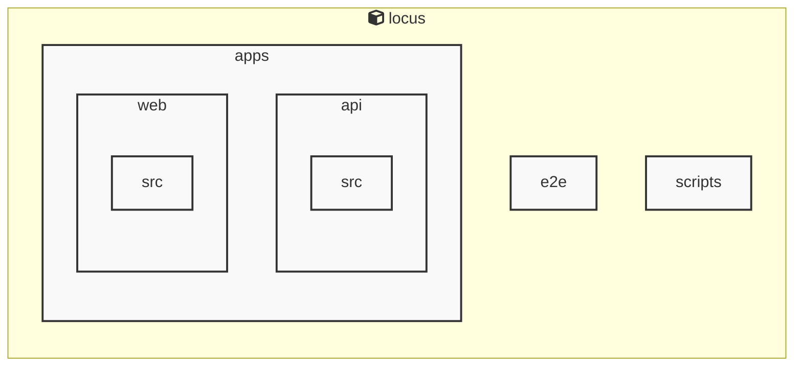

# AGENTS ドキュメント

自動生成日時: 2025-12-25 11:34:57

このドキュメントは、AIコーディングエージェントがプロジェクト内で効果的に作業するための指示とコンテキストを提供します。

---


<!-- MANUAL_START:description -->
Locus は、Markdown ノートと RSS フィードを一つのローカルに保持した知識ベースへ統合し、双方向リンクで相互参照できるパーソナルナレッジシステムです。
ユーザーは自分専用のノートを書き込みながら、インターネット上の情報をリアルタイムに取り込むことができます。また、全てのデータはローカルファイル（Markdown とメタデータ）として保存されるため、クラウドへの依存やプライバシーリスクを排除しつつ高速な検索とオフライン利用を実現します。
<!-- MANUAL_END:description -->

Locusは、MarkdownノートとRSSフィードを統合し、双方向リンクでつながる個人知識ベースをローカルファイルシステム上に構築することを目的としたオープンソースプロジェクトです。  
- **ローカル第一設計**：すべてのデータはユーザーのマシン内に保持され、インターネット接続がなくても完全な検索・閲覧機能を提供します。必要に応じてバックアップや同期用CLI（例: `locus sync`）でクラウドストレージと連携できます。  
- **Markdownベースのノート**：任意のテキストエディタで作成した`.md`ファイルをそのままインデックス化し、タグやフロントマターも自動解析します。リンクは `[[ページ名]]` 形式により簡単に設定でき、相互参照が可視化されます。  
- **RSS統合**：指定したフィードURLを監視して新記事を取得し、自動でMarkdownファイルへ保存・インデックスします。ユーザーは「#rss」タグやカスタムメタ情報で整理できます。  
- **双方向リンクとグラフ表示**：ノート間のリレーションシップを解析し、CLIベースまたはWeb UI（オプショナル）でトピックネットワーク図として可視化します。これにより知識構造が直感的に把握できます。  
- **拡張性**：TypeScript/JavaScriptのAPIとShellスクリプトを組み合わせてカスタムプラグインや自動処理（バックアップ、エクスポート）を書き込むことが可能です。  

技術概要  
| コンポーネント | 言語 / ツール |
|-----------------|---------------|
| コアロジック   | TypeScript (ESNext) |
| CLI・スクリプト  | Node.js + npm, Bash/Shell |
| パッケージ管理 | npm |

Locusは、ノート作成と情報収集を同じ場所で完結させたい開発者やリサーチャーに最適なツールです。ローカルファイルとしての可搬性・永続化が保証される一方、RSSフィードとの統合で最新情報も自動的に取り込めます。また、双方向リンクとグラフ機能によって知識を「ネットワーク」として捉え直すことで、新たな洞察やアイデアの発掘が促進されます。
**使用技術**: typescript, javascript, shell
## プロジェクト構造
```
├── apps//
│   ├── api//
│   │   ├── package.json
│   │   └── tsconfig.json
│   └── web//
│       ├── package.json
│       └── tsconfig.json
├── docs/
├── packages//
│   └── shared//
│       ├── package.json
│       └── tsconfig.json
├── playwright-report//
│   └── data//
│       ├── 43f6d6bbdc0e9b7d9a7dbcacaad485eab9c919e2.md
│       ├── 4b48a192a0b429d7e6318dfa399a20bb896e9f30.md
│       └── 6d27d4c8f06f97d0a27c03343afd96cc6f999d31.md
├── scripts/
├── AGENTS.md
├── README.md
├── biome.json
├── package.json
├── pyproject.toml
└── tsconfig.json
```
## アーキテクチャ

<!-- MANUAL_START:architecture -->

<!-- MANUAL_END:architecture -->


## Services

### locus
- **Type**: typescript
- **Description**: Locus is a local-first personal knowledge system that integrates Markdown notes, RSS feeds, and bidirectional links into a unified knowledge space.
- **Dependencies**: @biomejs/biome, @libsql/client, @playwright/test, @types/bun

---

## 開発環境のセットアップ

<!-- MANUAL_START:setup -->

<!-- MANUAL_END:setup -->
### 前提条件
- Node.js 18以上

### 依存関係のインストール
#### TypeScript依存関係

```bash
npm install
```

### LLM環境のセットアップ
#### ローカルLLMを使用する場合

1. **ローカルLLMのインストール**

   - Ollamaをインストール: https://ollama.ai/
   - モデルをダウンロード: `ollama pull llama3`
   - サービスを起動: `ollama serve`

2. **ローカルLLM使用時の注意事項**
   - モデルが起動していることを確認してください
   - ローカルリソース（メモリ、CPU）を監視してください

---


## ビルドおよびテスト手順

### ビルド手順
```bash
npm run lint
npm run lint:fix
npm run format
npm run format:check
npm run check
# ... その他のコマンド
```

### テスト実行
```bash
npm test
```
## コマンド

プロジェクトで利用可能なスクリプト:

| コマンド | 説明 |
| --- | --- |
| `lint` | biome lint . |
| `lint:fix` | biome lint --write . |
| `format` | biome format --write . |
| `format:check` | biome format . |
| `check` | biome check . |
| `check:fix` | biome check --write . |
| `migrate` | bun run scripts/migrate.ts |
| `dev:api` | bun run apps/api/src/server.ts |
| `dev:web` | bun --cwd=apps/web run dev |
| `dev` | bunx concurrently --names 'API,WEB' --prefix-colors 'blue,green' 'bun run dev:api' 'bun run dev:web' |
| `test` | bun test |
| `test:api` | bun --cwd=apps/api test |
| `test:web` | bun --cwd=apps/web test |
| `test:e2e` | playwright test |
| `test:e2e:ui` | bash scripts/test-e2e-ui.sh |
---

## コーディング規約

<!-- MANUAL_START:other -->

<!-- MANUAL_END:other -->

---

## プルリクエストの手順

<!-- MANUAL_START:pr -->

<!-- MANUAL_END:pr -->
1. **ブランチの作成**
   ```bash
   git checkout -b feature/your-feature-name
   ```

2. **変更のコミット**
   - コミットメッセージは明確で説明的に
   - 関連するIssue番号を含める

3. **テストの実行**
   ```bash
   npm test
   ```

4. **プルリクエストの作成**
   - タイトル: `[種類] 簡潔な説明`
   - 説明: 変更内容、テスト結果、関連Issueを記載

---

*このAGENTS.mdは自動生成されています。最終更新: 2025-12-25 11:34:57*