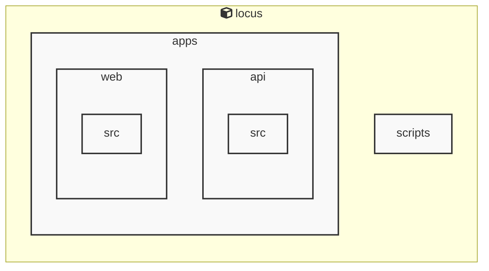

# AGENTS ドキュメント

自動生成日時: 2025-12-24 05:53:59

このドキュメントは、AIコーディングエージェントがプロジェクト内で効果的に作業するための指示とコンテキストを提供します。

---


<!-- MANUAL_START:description -->
Locus は、Markdown ノートと RSS フィードを一つのローカルに保持した知識ベースへ統合し、双方向リンクで相互参照できるパーソナルナレッジシステムです。
ユーザーは自分専用のノートを書き込みながら、インターネット上の情報をリアルタイムに取り込むことができます。また、全てのデータはローカルファイル（Markdown とメタデータ）として保存されるため、クラウドへの依存やプライバシーリスクを排除しつつ高速な検索とオフライン利用を実現します。
<!-- MANUAL_END:description -->


### 主な機能

| 機能 | 内容 |
|------|-----|
| **Markdown エディタ** | VS Code ライクな編集体験。リアルタイムプレビュー、シンタックスハイライト、スニペットなどの拡張性を備える。 |
| **RSS フィード統合** | ユーザーが登録したフィードから記事タイトルと本文を自動取得し、ノートとして保存。タグ付けやカテゴリ分けで整理可能。 |
| **双方向リンク** | `[[ページ名]]` 形式のリンクにより、自動的に相互参照リストを生成。グラフビューで知識ネットワークを可視化できる。 |
| **ローカル検索 & インデックス** | ElasticSearch ライクな全文検索エンジン（軽量版）を内蔵し、キーワードやリンク関係に基づく高速クエリが可能。 |
| **プラグインアーキテクチャ** | TypeScript で実装されており、npm パッケージとして簡単に拡張・統合できる。例えば、画像の自動埋め込みや外部 API 連携などが追加しやすい設計。 |
| **オフライン優先** | 全データはファイルシステム上（`.locus` ディレクトリ）に保存され、ネットワーク接続不可時でも完全機能を保持。同期機能も必要なら別途実装可能。 |

### 技術スタック

- **言語**：TypeScript/JavaScript (ES2020+)
- **ビルドツール**：tsc + esbuild
- **パッケージマネージャー**：npm（`package.json` に依存関係を管理）
- **データストア**：ローカルファイルシステム＋軽量インデックスライブラリ
  （例: `lunr.js` や自前の B+ 木構造）
- **UI/UX**：React + Electron（または Web 向け SPA）

### 利用ケース

1. **研究者・学生** – 論文や講義ノートを Markdown でまとめ、関連するオンライン記事を RSS フィードから自動取得しつつ、双方向リンクで知識の相関性を可視化。
2. **プロダクトマネージャー** – 製品ロードマップと市場情報を同一ベースに統合し、意思決定時に必要なデータへ瞬時アクセス。
3. **ライター・ブロガー** – インスピレーションやリサーチ資料をオフラインで管理しつつ、執筆中の記事とリンクさせてコンテンツ構造を整える。

### まとめ

Locus は「知識＝ファイル＋相互参照」の哲学に基づき、ローカル第一・プライバシー保護型でありながらもウェブ情報との統合性と拡張性を兼ね備えたツールです。TypeScript で構築されたモジュラー設計は既存の開発ワークフローに容易に組み込め、エコシステムが成長するにつれてプラグインやテーマなどコミュニティドリブンな拡張を期待できます。
**使用技術**: typescript, javascript
## プロジェクト構造
```
├── apps//
│   ├── api//
│   │   ├── package.json
│   │   └── tsconfig.json
│   └── web//
│       ├── package.json
│       └── tsconfig.json
├── docs/
├── packages//
│   └── shared//
│       ├── package.json
│       └── tsconfig.json
├── scripts/
├── AGENTS.md
├── README.md
├── biome.json
├── package.json
├── pyproject.toml
└── tsconfig.json
```
## アーキテクチャ

<!-- MANUAL_START:architecture -->
<!-- MANUAL_END:architecture -->


## Services

### locus
- **Type**: typescript
- **Description**: Locus is a local-first personal knowledge system that integrates Markdown notes, RSS feeds, and bidirectional links into a unified knowledge space.
- **Dependencies**: @biomejs/biome, @libsql/client, @types/bun

---

## 開発環境のセットアップ

<!-- MANUAL_START:setup -->
<!-- MANUAL_END:setup -->
### 前提条件
- Node.js 18以上

### 依存関係のインストール
#### TypeScript依存関係

```bash
npm install
```

### LLM環境のセットアップ
#### ローカルLLMを使用する場合

1. **ローカルLLMのインストール**

   - Ollamaをインストール: https://ollama.ai/
   - モデルをダウンロード: `ollama pull llama3`
   - サービスを起動: `ollama serve`

2. **ローカルLLM使用時の注意事項**
   - モデルが起動していることを確認してください
   - ローカルリソース（メモリ、CPU）を監視してください

---


## ビルドおよびテスト手順

### ビルド手順
```bash
npm run lint
npm run lint:fix
npm run format
npm run format:check
npm run check
# ... その他のコマンド
```

### テスト実行
テストコマンドは設定されていません。
## コマンド

プロジェクトで利用可能なスクリプト:

| コマンド | 説明 |
| --- | --- |
| `lint` | biome lint . |
| `lint:fix` | biome lint --write . |
| `format` | biome format --write . |
| `format:check` | biome format . |
| `check` | biome check . |
| `check:fix` | biome check --write . |
| `migrate` | bun run scripts/migrate.ts |
| `dev:api` | bun run apps/api/src/server.ts |
| `dev:web` | bun --cwd=apps/web run dev |
| `dev` | bunx concurrently --names 'API,WEB' --prefix-colors 'blue,green' 'bun run dev:api' 'bun run dev:web' |
---

## コーディング規約

<!-- MANUAL_START:other -->
<!-- MANUAL_END:other -->

---

## プルリクエストの手順

<!-- MANUAL_START:pr -->
<!-- MANUAL_END:pr -->
1. **ブランチの作成**
   ```bash
   git checkout -b feature/your-feature-name
   ```

2. **変更のコミット**
   - コミットメッセージは明確で説明的に
   - 関連するIssue番号を含める

3. **テストの実行**
   ```bash
   # テストコマンドを実行
   ```

4. **プルリクエストの作成**
   - タイトル: `[種類] 簡潔な説明`
   - 説明: 変更内容、テスト結果、関連Issueを記載

---

*このAGENTS.mdは自動生成されています。最終更新: 2025-12-24 05:53:59*
