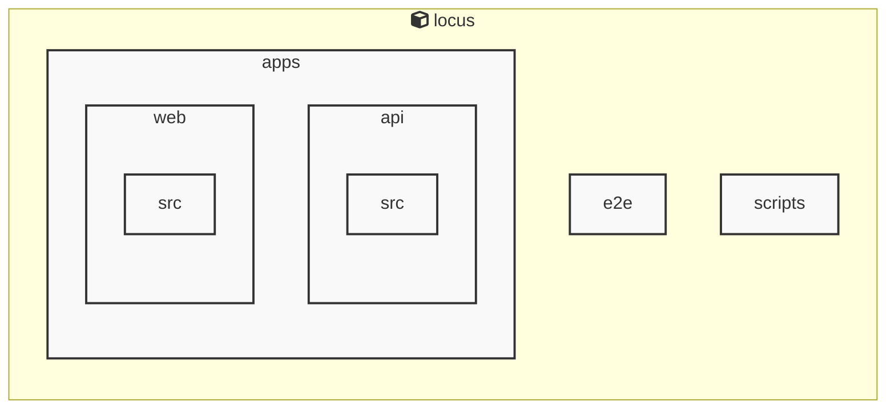

# AGENTS ドキュメント

自動生成日時: 2025-12-29 18:55:05

このドキュメントは、AIコーディングエージェントがプロジェクト内で効果的に作業するための指示とコンテキストを提供します。

---


<!-- MANUAL_START:description -->
Locus は、Markdown ノートと RSS フィードを一つのローカルに保持した知識ベースへ統合し、双方向リンクで相互参照できるパーソナルナレッジシステムです。
ユーザーは自分専用のノートを書き込みながら、インターネット上の情報をリアルタイムに取り込むことができます。また、全てのデータはローカルファイル（Markdown とメタデータ）として保存されるため、クラウドへの依存やプライバシーリスクを排除しつつ高速な検索とオフライン利用を実現します。
<!-- MANUAL_END:description -->

Locus は、Markdown ノートと RSS フィードを統合し、双方向リンクで相互に結び付けるローカルファーストのパーソナル知識管理システムです。  
- **データモデル**: 各ノートは Markdown ファイルとして保存され、YAML front‑matter で `id`, `title`, `tags` 等を保持します。リンクは `[[note-id]]` の形式で記述し、自動的に逆参照が生成されます。RSS フィードのエントリも同様にノート化され、元記事への URL と取得日時をメタ情報として格納します。  
- **ストレージ**: すべてのファイルはローカルディスク上（`./data/notes`, `./data/feed.zip` 等）に保存し、Git リポジトリや外部クラウドと簡単に同期できます。データベースを使用せずとも全文検索が可能なように、Node.js のファイルシステム API と `cheerio` でパーサー処理を行います。  
- **主要機能**:  
  - RSS フィードの定期取得（cron スクリプトまたは手動コマンド）と HTML を Markdown に変換 (`jszip`, `cheerio`)  
  - ノート間リンク解析、逆参照リスト生成、GraphQL/REST API 経由で検索・閲覧可能  
  - マークダウンエディタ統合（VS Code 拡張等）による編集体験向上  
- **開発スタック**: TypeScript + JavaScript (Node.js) が主軸。npm を使用し、`cheerio@^1.1.2`, `jszip@^3.10.1` などのライブラリで RSS のパースとアーカイブ処理を行います。  
- **拡張性**: プラグインシステムにより、新しいデータソース（例：Twitter, Notion API）や検索エンジン（ElasticSearch 等）の追加が容易です。  

AI エージェントは、上記のファイル構成とリンク規則を理解し、ノート作成・更新時に自動で逆参照を補完したり、RSS 取得スクリプトを呼び出して最新情報を取り込むことで Locus の知識ベースを継続的に拡張できます。
**使用技術**: typescript, javascript, shell
## プロジェクト構造
```
├── apps//
│   ├── api//
│   │   ├── package.json
│   │   └── tsconfig.json
│   └── web//
│       ├── package.json
│       └── tsconfig.json
├── docs/
├── packages//
│   └── shared//
│       ├── package.json
│       └── tsconfig.json
├── scripts/
├── AGENTS.md
├── README.md
├── biome.json
├── package.json
├── pyproject.toml
└── tsconfig.json
```
## アーキテクチャ

<!-- MANUAL_START:architecture -->

<!-- MANUAL_END:architecture -->


## Services

### locus
- **Type**: typescript
- **Description**: Locus is a local-first personal knowledge system that integrates Markdown notes, RSS feeds, and bidirectional links into a unified knowledge space.
- **Dependencies**: @biomejs/biome, @libsql/client, @playwright/test, @types/bun, @types/cheerio, @types/jszip, cheerio, jszip

---

## 開発環境のセットアップ

<!-- MANUAL_START:setup -->

<!-- MANUAL_END:setup -->
### 前提条件
- Node.js 18以上

### 依存関係のインストール
#### TypeScript依存関係

```bash
npm install
```

### LLM環境のセットアップ
#### ローカルLLMを使用する場合

1. **ローカルLLMのインストール**

   - Ollamaをインストール: https://ollama.ai/
   - モデルをダウンロード: `ollama pull llama3`
   - サービスを起動: `ollama serve`

2. **ローカルLLM使用時の注意事項**
   - モデルが起動していることを確認してください
   - ローカルリソース（メモリ、CPU）を監視してください

---


## ビルドおよびテスト手順

### ビルド手順
```bash
npm run lint
npm run lint:fix
npm run format
npm run format:check
npm run check
# ... その他のコマンド
```

### テスト実行
```bash
npm test
```
## コマンド

プロジェクトで利用可能なスクリプト:

| コマンド | 説明 |
| --- | --- |
| `lint` | biome lint . |
| `lint:fix` | biome lint --write . |
| `format` | biome format --write . |
| `format:check` | biome format . |
| `check` | biome check . |
| `check:fix` | biome check --write . |
| `migrate` | bun run scripts/migrate.ts |
| `deploy:public-site` | bun run scripts/deploy-public-site.ts |
| `dev:api` | bun run apps/api/src/server.ts |
| `dev:web` | bun --cwd=apps/web run dev |
| `dev` | bunx concurrently --names 'API,WEB' --prefix-colors 'blue,green' 'bun run dev:api' 'bun run dev:web' |
| `test` | bun test |
| `test:api` | bun --cwd=apps/api test |
| `test:web` | bun --cwd=apps/web test |
| `test:e2e` | playwright test |
| `test:e2e:ui` | bash scripts/test-e2e-ui.sh |
---

## コーディング規約

<!-- MANUAL_START:other -->

<!-- MANUAL_END:other -->

---

## プルリクエストの手順

<!-- MANUAL_START:pr -->

<!-- MANUAL_END:pr -->
1. **ブランチの作成**
   ```bash
   git checkout -b feature/your-feature-name
   ```

2. **変更のコミット**
   - コミットメッセージは明確で説明的に
   - 関連するIssue番号を含める

3. **テストの実行**
   ```bash
   npm test
   ```

4. **プルリクエストの作成**
   - タイトル: `[種類] 簡潔な説明`
   - 説明: 変更内容、テスト結果、関連Issueを記載

---

*このAGENTS.mdは自動生成されています。最終更新: 2025-12-29 18:55:05*