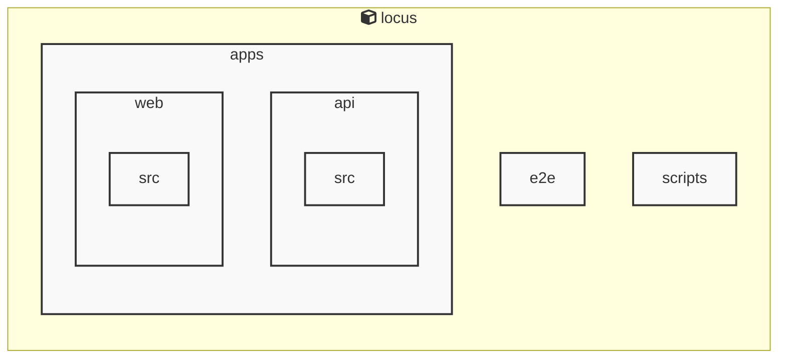

# AGENTS ドキュメント

自動生成日時: 2025-12-28 16:50:03

このドキュメントは、AIコーディングエージェントがプロジェクト内で効果的に作業するための指示とコンテキストを提供します。

---


<!-- MANUAL_START:description -->
Locus は、Markdown ノートと RSS フィードを一つのローカルに保持した知識ベースへ統合し、双方向リンクで相互参照できるパーソナルナレッジシステムです。
ユーザーは自分専用のノートを書き込みながら、インターネット上の情報をリアルタイムに取り込むことができます。また、全てのデータはローカルファイル（Markdown とメタデータ）として保存されるため、クラウドへの依存やプライバシーリスクを排除しつつ高速な検索とオフライン利用を実現します。
<!-- MANUAL_END:description -->

Locus は、ローカルファーストのパーソナル知識管理システムです。Markdown 形式で書かれたノートと RSS フィードを一元化し、双方向リンク（bidirectional links）によりノート間の関係性を可視化・検索可能な「統合知識空間」を構築します。

- **データストレージ**  
  - ノートは Markdown ファイルとしてローカルディスク上に保存。ファイル名やパスから自動的にタグ付けと階層が生成され、オフラインでも高速検索可能です。
  - RSS フィードは定期取得し `cheerio` を使って HTML パース後、Markdown に変換して同じディレクトリ構造へ保存。記事ごとのメタデータ（公開日時・著者）も埋め込みます。

- **双方向リンク**  
  - ノート内に `[[ノード名]]` を記述すると、自動でインバウンド/アウトボウンドの参照リストが生成され、グラフビューやクエリ機能（例：検索語を含む全てのノートとリンク先）へ直結します。
  - `jszip` により大規模なファイル群も ZIP 圧縮してバックアップ/同期に利用可能。

- **オフライン優先**  
  - 全データはローカルに保持され、ネットワーク切断時でも完全機能。必要ならば外部ストレージへ手動でエクスポートできます。
  - Node.js / TypeScript の実装をベースとし、`npm` パッケージとして配布することで既存の JavaScript エコシステム（VSCode 拡張・CLI ツール等）との統合が容易です。

- **AI アプリケーションへの活用**  
  - Locus のノートは構造化された Markdown として保存されるため、LLM が自然言語クエリを解析し、関連するノードやリンク先を即座に返すことができます。
  - RSS フィードの自動更新機能で最新情報を継続的に取り込み、AI アシスタントがトピック別の知識ベースとして参照できるようになります。

- **開発・実行環境**  
  - TypeScript/JavaScript（Node.js）＋Shell スクリプト。`cheerio@^1.1.2`, `jszip@^3.10.1` 等を依存に持ち、npm を通じて簡単にインストール・アップデート可能です。

Locus は「ローカルで完全制御しつつも AI とのシームレスな連携」を実現するためのプラットフォームとして設計されており、個人知識ベースを構築したい開発者やAIエージェントにとって理想的な選択肢です。
**使用技術**: typescript, javascript, shell
## プロジェクト構造
```
├── apps//
│   ├── api//
│   │   ├── package.json
│   │   └── tsconfig.json
│   └── web//
│       ├── package.json
│       └── tsconfig.json
├── docs/
├── packages//
│   └── shared//
│       ├── package.json
│       └── tsconfig.json
├── scripts/
├── AGENTS.md
├── README.md
├── biome.json
├── package.json
├── pyproject.toml
└── tsconfig.json
```
## アーキテクチャ

<!-- MANUAL_START:architecture -->

<!-- MANUAL_END:architecture -->


## Services

### locus
- **Type**: typescript
- **Description**: Locus is a local-first personal knowledge system that integrates Markdown notes, RSS feeds, and bidirectional links into a unified knowledge space.
- **Dependencies**: @biomejs/biome, @libsql/client, @playwright/test, @types/bun, @types/cheerio, @types/jszip, cheerio, jszip

---

## 開発環境のセットアップ

<!-- MANUAL_START:setup -->

<!-- MANUAL_END:setup -->
### 前提条件
- Node.js 18以上

### 依存関係のインストール
#### TypeScript依存関係

```bash
npm install
```

### LLM環境のセットアップ
#### ローカルLLMを使用する場合

1. **ローカルLLMのインストール**

   - Ollamaをインストール: https://ollama.ai/
   - モデルをダウンロード: `ollama pull llama3`
   - サービスを起動: `ollama serve`

2. **ローカルLLM使用時の注意事項**
   - モデルが起動していることを確認してください
   - ローカルリソース（メモリ、CPU）を監視してください

---


## ビルドおよびテスト手順

### ビルド手順
```bash
npm run lint
npm run lint:fix
npm run format
npm run format:check
npm run check
# ... その他のコマンド
```

### テスト実行
```bash
npm test
```
## コマンド

プロジェクトで利用可能なスクリプト:

| コマンド | 説明 |
| --- | --- |
| `lint` | biome lint . |
| `lint:fix` | biome lint --write . |
| `format` | biome format --write . |
| `format:check` | biome format . |
| `check` | biome check . |
| `check:fix` | biome check --write . |
| `migrate` | bun run scripts/migrate.ts |
| `dev:api` | bun run apps/api/src/server.ts |
| `dev:web` | bun --cwd=apps/web run dev |
| `dev` | bunx concurrently --names 'API,WEB' --prefix-colors 'blue,green' 'bun run dev:api' 'bun run dev:web' |
| `test` | bun test |
| `test:api` | bun --cwd=apps/api test |
| `test:web` | bun --cwd=apps/web test |
| `test:e2e` | playwright test |
| `test:e2e:ui` | bash scripts/test-e2e-ui.sh |
---

## コーディング規約

<!-- MANUAL_START:other -->

<!-- MANUAL_END:other -->

---

## プルリクエストの手順

<!-- MANUAL_START:pr -->

<!-- MANUAL_END:pr -->
1. **ブランチの作成**
   ```bash
   git checkout -b feature/your-feature-name
   ```

2. **変更のコミット**
   - コミットメッセージは明確で説明的に
   - 関連するIssue番号を含める

3. **テストの実行**
   ```bash
   npm test
   ```

4. **プルリクエストの作成**
   - タイトル: `[種類] 簡潔な説明`
   - 説明: 変更内容、テスト結果、関連Issueを記載

---

*このAGENTS.mdは自動生成されています。最終更新: 2025-12-28 16:50:03*