# Locus

<!-- MANUAL_START:notice -->
> このドキュメントは自動生成されています。そのため不正確な内容が含まれている可能性があります。
<!-- MANUAL_END:notice -->


<!-- MANUAL_START:description -->
Locus は「ローカルファースト」をモットーに設計された個人知識管理システムです。
ノートは Markdown で書き、すべてのデータ（Markdown ファイル、メタ情報、リンク構造）はユーザー自身が所有するローカルストレージに保存されます。そのためインターネット接続不要・外部サービスへの依存なしに知識を蓄積できるほか、プライバシーやデータセキュリティも担保します。
<!-- MANUAL_END:description -->
Locusは、ローカルファーストで構築されたパーソナルナレッジシステムです。MarkdownノートとRSSフィードを一元管理し、双方向リンク機能により情報同士の関連性が可視化されます。

- **データストア**：すべてのノートはローカルファイル（`.md`）として保存されるため、オフライン時でも完全なアクセスと編集が可能です。  
- **RSS統合**：外部情報を取り込みたい場合、指定したフィードURLから記事を取得し、自動的にMarkdownノートへ変換します。Cheerio（HTMLパーサ）で構造化データを抽出し、jszipでアーカイブ形式のインポート/エクスポートも実装しています。  
- **双方向リンク**：`[[ページ名]]` のようなシンタックスでノード間に相互参照を作成できるため、知識グラフとして自然に拡張できます。  
- **開発スタック**：TypeScriptベースのNode.js CLIと補助的なShellスクリプトから構成されます。依存ライブラリは `cheerio@^1.1.2` と `jszip@^3.10.1` を中心に、npmで管理されています。

簡単な利用例  
```bash
# プロジェクトを初期化
npx locus init

# RSSフィードからノートを取得
locus import-rss https://example.com/feed.xml

# ノート間のリンクを確認
locus graph
```

Locusは、個人が情報を整理しつつも外部データと連携できる柔軟な知識ベースとして設計されています。<!-- MANUAL_START:architecture -->

<!-- MANUAL_END:architecture -->


```mermaid
graph TB
    %% Auto-generated architecture diagram

    subgraph locus [fa:fa-cube locus]
        direction TB
        subgraph at_locus_api [&#64;locus/api]
            direction TB
            subgraph at_locus_api_src [src]
                direction TB
                subgraph at_locus_api_src_db [db]
                    direction TB
                    at_locus_api_src_db_utils["utils"]:::moduleStyle
                end
                class at_locus_api_src_db moduleStyle
                at_locus_api_src_utils["utils"]:::moduleStyle
                at_locus_api_src_middleware["middleware"]:::moduleStyle
                at_locus_api_src_routes["routes"]:::moduleStyle
                subgraph at_locus_api_src_services [services]
                    direction TB
                    at_locus_api_src_services_utils["utils"]:::moduleStyle
                    at_locus_api_src_services_export["export"]:::moduleStyle
                    at_locus_api_src_services_llm["llm"]:::moduleStyle
                end
                class at_locus_api_src_services moduleStyle
            end
            class at_locus_api_src moduleStyle
        end
        class at_locus_api moduleStyle
        subgraph at_locus_web [&#64;locus/web]
            direction TB
            subgraph at_locus_web_src [src]
                direction TB
                subgraph at_locus_web_src_lib [lib]
                    direction TB
                    at_locus_web_src_lib_utils["utils"]:::moduleStyle
                    at_locus_web_src_lib_services["services"]:::moduleStyle
                    at_locus_web_src_lib_stores["stores"]:::moduleStyle
                    at_locus_web_src_lib_hooks["hooks"]:::moduleStyle
                    at_locus_web_src_lib_types["types"]:::moduleStyle
                    at_locus_web_src_lib_api["api"]:::moduleStyle
                    at_locus_web_src_lib_components["components"]:::moduleStyle
                end
                class at_locus_web_src_lib moduleStyle
            end
            class at_locus_web_src moduleStyle
        end
        class at_locus_web moduleStyle
        subgraph at_locus_shared [&#64;locus/shared]
            direction TB
            subgraph at_locus_shared_src [src]
                direction TB
                at_locus_shared_src_types["types"]:::moduleStyle
            end
            class at_locus_shared_src moduleStyle
        end
        class at_locus_shared moduleStyle
    end

    at_locus_api --> at_locus_shared
    at_locus_web --> at_locus_api
    at_locus_web --> at_locus_shared

    classDef pythonStyle fill:#3776ab,stroke:#ffd43b,stroke-width:2px,color:#fff
    classDef dockerStyle fill:#2496ed,stroke:#1d63ed,stroke-width:2px,color:#fff
    classDef dbStyle fill:#336791,stroke:#6b9cd6,stroke-width:2px,color:#fff
    classDef moduleStyle fill:#f9f9f9,stroke:#333,stroke-width:2px
```

## Services

### locus
- **Type**: typescript
- **Description**: Locus is a local-first personal knowledge system that integrates Markdown notes, RSS feeds, and bidirectional links into a unified knowledge space.
- **Dependencies**: &#64;biomejs/biome, &#64;libsql/client, &#64;playwright/test, &#64;types/bun, &#64;types/cheerio, &#64;types/jszip, cheerio, jszip

## 使用技術

- TypeScript
- JavaScript
- Shell

## 依存関係

- **Node.js**: `package.json` を参照

## セットアップ


## 前提条件


- Node.js (推奨バージョン: 18以上)


## インストール


### JavaScript

```bash
# npmを使用する場合
npm install
```


## LLM環境のセットアップ

### APIを使用する場合

1. **APIキーの取得と設定**

   - OpenAI APIキーを取得: https://platform.openai.com/api-keys
   - 環境変数に設定: `export OPENAI_API_KEY=your-api-key-here`

2. **API使用時の注意事項**
   - APIレート制限に注意してください
   - コスト管理のために使用量を監視してください

### ローカルLLMを使用する場合

1. **ローカルLLMのインストール**

   - Ollamaをインストール: https://ollama.ai/
   - モデルをダウンロード: `ollama pull llama3`
   - サービスを起動: `ollama serve`

2. **ローカルLLM使用時の注意事項**
   - モデルが起動していることを確認してください
   - ローカルリソース（メモリ、CPU）を監視してください

## ビルドおよびテスト
### ビルド

```bash
npm run lint
npm run lint:fix
npm run format
npm run format:check
npm run check
# ... その他のコマンド
```
### テスト

```bash
npm test
```
## コマンド

プロジェクトで利用可能なスクリプト:

| コマンド | 説明 |
| --- | --- |
| `lint` | biome lint . |
| `lint:fix` | biome lint --write . |
| `format` | biome format --write . |
| `format:check` | biome format . |
| `check` | biome check . |
| `check:fix` | biome check --write . |
| `migrate` | bun run scripts/migrate.ts |
| `deploy:public-site` | bun run scripts/deploy-public-site.ts |
| `dev:api` | bun run apps/api/src/server.ts |
| `dev:web` | bun --cwd=apps/web run dev |
| `dev` | bunx concurrently --names 'API,WEB' --prefix-colors 'blue,green' 'bun run dev:api' 'bun run dev:web' |
| `test` | bun test apps packages |
| `test:api` | bun --cwd=apps/api test |
| `test:web` | bun --cwd=apps/web test |
| `test:coverage` | bun test --coverage apps/api/src apps/web/src |
| `test:coverage:api` | bun test --coverage apps/api/src |
| `test:coverage:web` | bun test --coverage apps/web/src |
| `test:e2e` | playwright test |
| `test:e2e:ui` | bash scripts/test-e2e-ui.sh |

---

*このREADME.mdは自動生成されています。最終更新: 2026-01-01 05:54:45*