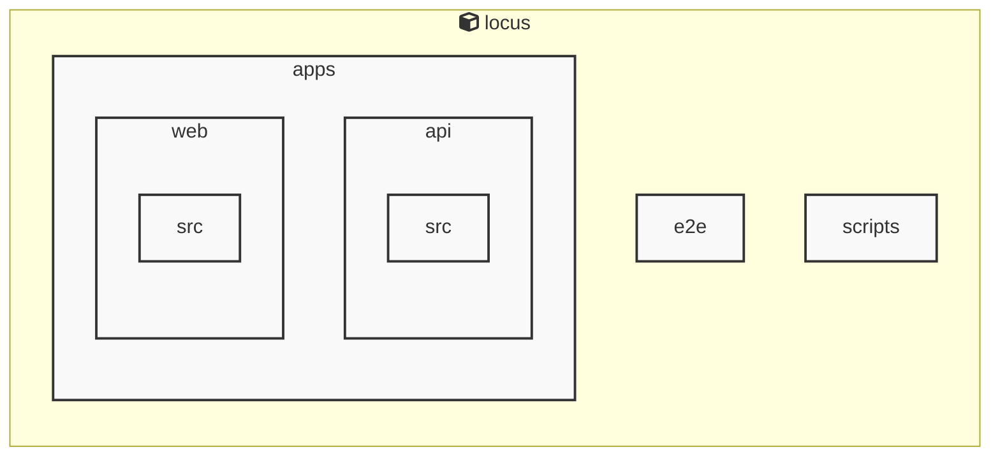

# Locus

<!-- MANUAL_START:notice -->
> このドキュメントは自動生成されています。そのため不正確な内容が含まれている可能性があります。
<!-- MANUAL_END:notice -->


<!-- MANUAL_START:description -->
Locus は「ローカルファースト」をモットーに設計された個人知識管理システムです。
ノートは Markdown で書き、すべてのデータ（Markdown ファイル、メタ情報、リンク構造）はユーザー自身が所有するローカルストレージに保存されます。そのためインターネット接続不要・外部サービスへの依存なしに知識を蓄積できるほか、プライバシーやデータセキュリティも担保します。
<!-- MANUAL_END:description -->
Locus は、Markdown ノートと RSS フィードを統合し、双方向リンクで知識のネットワーク化を実現する「ローカルファースト」型パーソナルナレッジシステムです。
- **ノート**：全て Markdown 形式で保存されるため、テキストエディタや VS Code 等から直接編集可能。
- **RSS フィードの取り込み**：Web サイトやブログの更新を自動取得し、指定したフォルダへマージすることで「知識ベース」を常に最新状態で維持します（`cheerio@^1.1.2` を利用して HTML パーシング）。
- **双方向リンク**：ノート内で `[[別のノート]]` のような参照を書くだけで、リンク先と逆方向も自動的に登録されるため、知識間の関係性を可視化できます。
- **ローカルファースト設計**：全データはユーザー側のディレクトリ（例: `~/.locus`）に保存し、ネットワーク接続がなくても完全動作します。必要であれば手動または自動でクラウドストレージへバックアップ／同期できます。
- **CLI とスクリプト**：Node.js ベースのコマンドラインツール（`npm run start` など）とシェルスクリプトを組み合わせ、ノート生成・検索・エクスポート (`jszip@^3.10.1`) を簡易に実行できます。
- **拡張性**：TypeScript/JavaScript のコードベースはモジュール化されており、新しいフィードソースやカスタムプラグインを追加しやすい構成です。

これらの機能が組み合わさることで、個人情報保護に配慮した上で「ノート → フィード → 連結」という一貫したワークフローを実現します。<!-- MANUAL_START:architecture -->

<!-- MANUAL_END:architecture -->


## Services

### locus
- **Type**: typescript
- **Description**: Locus is a local-first personal knowledge system that integrates Markdown notes, RSS feeds, and bidirectional links into a unified knowledge space.
- **Dependencies**: @biomejs/biome, @libsql/client, @playwright/test, @types/bun, @types/cheerio, @types/jszip, cheerio, jszip

## 使用技術

- TypeScript
- JavaScript
- Shell

## 依存関係

- **Node.js**: `package.json` を参照

## セットアップ


## 前提条件


- Node.js (推奨バージョン: 18以上)


## インストール


### JavaScript

```bash
# npmを使用する場合
npm install
```


## LLM環境のセットアップ

### APIを使用する場合

1. **APIキーの取得と設定**

   - OpenAI APIキーを取得: https://platform.openai.com/api-keys
   - 環境変数に設定: `export OPENAI_API_KEY=your-api-key-here`

2. **API使用時の注意事項**
   - APIレート制限に注意してください
   - コスト管理のために使用量を監視してください

### ローカルLLMを使用する場合

1. **ローカルLLMのインストール**

   - Ollamaをインストール: https://ollama.ai/
   - モデルをダウンロード: `ollama pull llama3`
   - サービスを起動: `ollama serve`

2. **ローカルLLM使用時の注意事項**
   - モデルが起動していることを確認してください
   - ローカルリソース（メモリ、CPU）を監視してください

## ビルドおよびテスト
### ビルド

```bash
npm run lint
npm run lint:fix
npm run format
npm run format:check
npm run check
# ... その他のコマンド
```
### テスト

```bash
npm test
npm run test:coverage  # カバレッジレポート付きでテスト実行
```

## 開発ガイドライン

### コードスタイル

- Biomeを使用してコードフォーマットとリントを実行
- コミット前に `npm run check` を実行してコード品質を確認

### テスト

- すべての新機能にはテストを追加
- テストカバレッジは80%以上を維持
- `npm run test:coverage` でカバレッジを確認

### JSDocコメント

- すべての公開関数・クラスにJSDocコメントを追加
- パラメータと戻り値の説明を含める
- エラーが発生する可能性がある場合は `@throws` を追加

### エラーハンドリング

- データベース層: `apps/api/src/db/utils/error-handler.ts` の `handleDbOperation` を使用
- サービス層: `apps/api/src/services/utils/error-handler.ts` の `handleServiceOperation` を使用
- カスタムエラー型（`DatabaseError`, `NotFoundError`, `ValidationError`）を適切に使用

### バリデーション

- ルート層では `apps/api/src/middleware/validation.ts` のバリデーション関数を使用
- 必須パラメータは `validateRequired` で検証
- 型チェックは `validateString`, `validateUUID` などを使用
## コマンド

プロジェクトで利用可能なスクリプト:

| コマンド | 説明 |
| --- | --- |
| `lint` | biome lint . |
| `lint:fix` | biome lint --write . |
| `format` | biome format --write . |
| `format:check` | biome format . |
| `check` | biome check . |
| `check:fix` | biome check --write . |
| `migrate` | bun run scripts/migrate.ts |
| `deploy:public-site` | bun run scripts/deploy-public-site.ts |
| `dev:api` | bun run apps/api/src/server.ts |
| `dev:web` | bun --cwd=apps/web run dev |
| `dev` | bunx concurrently --names 'API,WEB' --prefix-colors 'blue,green' 'bun run dev:api' 'bun run dev:web' |
| `test` | bun test |
| `test:api` | bun --cwd=apps/api test |
| `test:web` | bun --cwd=apps/web test |
| `test:e2e` | playwright test |
| `test:e2e:ui` | bash scripts/test-e2e-ui.sh |

---

*このREADME.mdは自動生成されています。最終更新: 2025-12-29 18:54:31*
