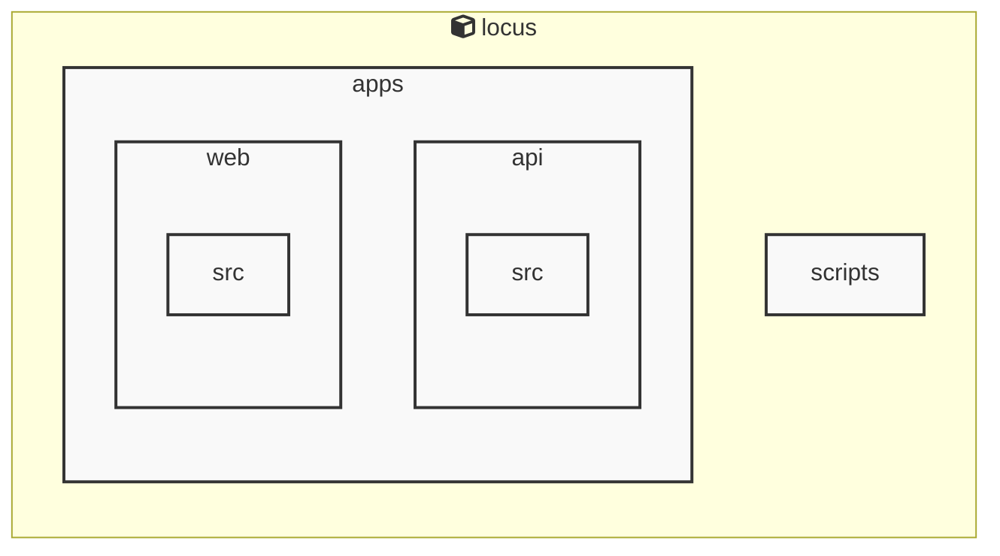

# Locus

<!-- MANUAL_START:notice -->
> このドキュメントは自動生成されています。そのため不正確な内容が含まれている可能性があります。
<!-- MANUAL_END:notice -->


<!-- MANUAL_START:description -->
Locus は「ローカルファースト」をモットーに設計された個人知識管理システムです。
ノートは Markdown で書き、すべてのデータ（Markdown ファイル、メタ情報、リンク構造）はユーザー自身が所有するローカルストレージに保存されます。そのためインターネット接続不要・外部サービスへの依存なしに知識を蓄積できるほか、プライバシーやデータセキュリティも担保します。
<!-- MANUAL_END:description -->

主な特徴

| 機能 | 説明 |
|------|------|
| **Markdown ノート** | 典型的な Markdown 文法（見出し・表・画像など）に加え、YAML フロントマターをサポート。ファイル名やフロントマタのタグでメタ情報管理が可能です。 |
| **RSS フィード統合** | RSS から記事を定期的または手動で取得し、自動生成されたノートとして保存します。タイトル・著者・公開日時、カテゴリなどのメタデータも保持されるため、後から検索やフィルタリングが容易です。 |
| **双方向リンク** | `[[Note Title]]` 形式で他ノートを参照すると、自動的にバックリンクリスト（どこから呼び出されたか）が生成されます。これにより知識のネットワーク構造を可視化し、関連情報へ迅速にアクセスできます。 |
| **ローカルデータベース** | ノートメタとインデックスは軽量な JSON/SQLite データストアで管理。高速検索（全文検索・タグ検索）や履歴管理が可能です。 |
| **CLI と Web UI の両方提供** | `locus` コマンドラインツールでノートの作成、編集、同期を行い、ブラウザベースのインターフェイスではビジュアルに閲覧・ナビゲーションができます（※実装状況はプロジェクトリポジトリをご確認ください）。 |
| **拡張性** | TypeScript で書かれたモジュール構造と npm パッケージとして公開されているため、ユーザー自身のプラグインやカスタムスクリプトを簡単に追加できます。 |

## 技術スタック

- **言語**: TypeScript (型安全性)、JavaScript（実行環境互換）
- **パッケージマネージャー**: npm
- **主要ライブラリ**
  - `markdown-it` / `remark`: Markdown パース・レンダリング
  - `rss-parser`: RSS フィード取得と解析
  - `lunr.js` または `flexsearch`: クイック全文検索
  - `lowdb`, `sqlite3` 等のローカルデータストア

## インストール & 初期設定（例）

```bash
npm install --global locus
locus init           # プロジェクトディレクトリを作成し、初期構造生成
```

その後は `locus add rss <URL>` で RSS フィードを登録し、`locus new "タイトル"` でノートを書き始めるだけです。

Locus は「知識のインフラ」を最小限に抑えつつ、Markdown と RSS の自然な組み合わせと双方向リンクによって情報同士を有機的につないだパーソナルナレッジベースへ変換します。<!-- MANUAL_START:architecture -->

<!-- MANUAL_END:architecture -->


## Services

### locus
- **Type**: typescript
- **Description**: Locus is a local-first personal knowledge system that integrates Markdown notes, RSS feeds, and bidirectional links into a unified knowledge space.
- **Dependencies**: @biomejs/biome, @libsql/client, @types/bun

## 使用技術

- TypeScript
- JavaScript

## 依存関係

- **Node.js**: `package.json` を参照

## セットアップ


## 前提条件


- Node.js (推奨バージョン: 18以上)


## インストール


### JavaScript

```bash
# npmを使用する場合
npm install
```


## LLM環境のセットアップ

### APIを使用する場合

1. **APIキーの取得と設定**

   - OpenAI APIキーを取得: https://platform.openai.com/api-keys
   - 環境変数に設定: `export OPENAI_API_KEY=your-api-key-here`

2. **API使用時の注意事項**
   - APIレート制限に注意してください
   - コスト管理のために使用量を監視してください

### ローカルLLMを使用する場合

1. **ローカルLLMのインストール**

   - Ollamaをインストール: https://ollama.ai/
   - モデルをダウンロード: `ollama pull llama3`
   - サービスを起動: `ollama serve`

2. **ローカルLLM使用時の注意事項**
   - モデルが起動していることを確認してください
   - ローカルリソース（メモリ、CPU）を監視してください

## ビルドおよびテスト
### ビルド

```bash
npm run lint
npm run lint:fix
npm run format
npm run format:check
npm run check
# ... その他のコマンド
```
## コマンド

プロジェクトで利用可能なスクリプト:

| コマンド | 説明 |
| --- | --- |
| `lint` | biome lint . |
| `lint:fix` | biome lint --write . |
| `format` | biome format --write . |
| `format:check` | biome format . |
| `check` | biome check . |
| `check:fix` | biome check --write . |
| `migrate` | bun run scripts/migrate.ts |
| `dev:api` | bun run apps/api/src/server.ts |
| `dev:web` | bun --cwd=apps/web run dev |
| `dev` | bunx concurrently --names 'API,WEB' --prefix-colors 'blue,green' 'bun run dev:api' 'bun run dev:web' |

---

*このREADME.mdは自動生成されています。最終更新: 2025-12-24 05:53:05*
