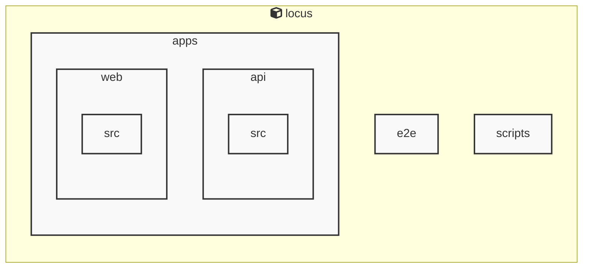

# Locus

<!-- MANUAL_START:notice -->
> このドキュメントは自動生成されています。そのため不正確な内容が含まれている可能性があります。
<!-- MANUAL_END:notice -->


<!-- MANUAL_START:description -->
Locus は「ローカルファースト」をモットーに設計された個人知識管理システムです。
ノートは Markdown で書き、すべてのデータ（Markdown ファイル、メタ情報、リンク構造）はユーザー自身が所有するローカルストレージに保存されます。そのためインターネット接続不要・外部サービスへの依存なしに知識を蓄積できるほか、プライバシーやデータセキュリティも担保します。
<!-- MANUAL_END:description -->
Locusは、ローカル優先（local‑first）を採用したパーソナルナレッジシステムです。  
- **Markdownノート**：任意のフォルダに保存された`.md`ファイルを自動的に検出し、タグやリンクで相互参照できるようにします。  
- **RSSフィード統合**：外部サイトから記事を取得してローカルに保存し、そのままMarkdownとして閲覧・編集できます。HTMLのパースには`cheerio@^1.1.2`、ZIP化/解凍は`jszip@^3.10.1`を利用しています。  
- **双方向リンク**：ノート内で`[[ページ名]]`と記述すると、自動的にリンク先のリストが生成されます。これにより知識ベース全体をグラフ状に把握でき、類似情報へ迅速にアクセスできます。

## 主な特徴

- **オフラインファースト**：すべてのデータはローカルディスク上（`~/.locus/notes`, `feeds.json` 等）に保存されるため、インターネット接続がなくても作業可能。  
- **シンプルなCLI操作**：`npx locus init`, `locus add <title>`, `locus fetch-feeds`, `locus link-list` などのコマンドでノート管理・RSS取得を行えます。  
- **拡張性**：TypeScript/JavaScriptベースなので、独自プラグインやスクリプトを書いて機能追加が容易です。  
- **セキュリティとプライバシー**：データはサーバに送信されずローカルだけで完結するため、個人情報の漏洩リスクを最小化します。

## 開発環境

| 言語 | バージョン |
|------|------------|
| TypeScript / JavaScript | 4.x+ (Node.js v18+) |
| Shell Script | Bash |

パッケージ管理は`npm`で行い、主要な依存関係は次のとおりです。

```bash
# 必須ライブラリ（例）
cheerio@^1.1.2   # RSSフィードやHTML解析用
jszip@^3.10.1    # アーカイブ作成/解凍
```

## 使い始め方

1. **プロジェクトの初期化**  
   ```bash
   npx locus init
   ```
2. **ノートを追加**  
   ```bash
   locus add "新しいトピック"
   # エディタが起動し、Markdownを書き込むことができます。
   ```
3. **RSSフィードの取得**  
   `feeds.json`にURLを登録後、以下でフェッチ。  
   ```bash
   locus fetch-feeds
   ```

4. **リンク関係の確認**  
   ```bash
   locus link-list --page "新しいトピック"
   ```
5. **知識ベース全体を見る**（オプション）  
   Locusは`--graph`フラグで簡易可視化を提供。  

> **Tip:** `locus config edit` で設定ファイル (`~/.config/locus/config.json`) を直接編集し、デフォルトのノートディレクトリやRSSフィード取得頻度などをカスタマイズできます。

---

Locusは「手元にある情報だけで完結できる知識管理」を目指して設計されており、メモ取りから長期的な研究資料まで幅広く対応します。ぜひ試し、自分のワークフローに合わせたカスタマイズを楽しんでください。<!-- MANUAL_START:architecture -->

<!-- MANUAL_END:architecture -->


## Services

### locus
- **Type**: typescript
- **Description**: Locus is a local-first personal knowledge system that integrates Markdown notes, RSS feeds, and bidirectional links into a unified knowledge space.
- **Dependencies**: @biomejs/biome, @libsql/client, @playwright/test, @types/bun, @types/cheerio, @types/jszip, cheerio, jszip

## 使用技術

- TypeScript
- JavaScript
- Shell

## 依存関係

- **Node.js**: `package.json` を参照

## セットアップ


## 前提条件


- Node.js (推奨バージョン: 18以上)


## インストール


### JavaScript

```bash
# npmを使用する場合
npm install
```


## LLM環境のセットアップ

### APIを使用する場合

1. **APIキーの取得と設定**

   - OpenAI APIキーを取得: https://platform.openai.com/api-keys
   - 環境変数に設定: `export OPENAI_API_KEY=your-api-key-here`

2. **API使用時の注意事項**
   - APIレート制限に注意してください
   - コスト管理のために使用量を監視してください

### ローカルLLMを使用する場合

1. **ローカルLLMのインストール**

   - Ollamaをインストール: https://ollama.ai/
   - モデルをダウンロード: `ollama pull llama3`
   - サービスを起動: `ollama serve`

2. **ローカルLLM使用時の注意事項**
   - モデルが起動していることを確認してください
   - ローカルリソース（メモリ、CPU）を監視してください

## ビルドおよびテスト
### ビルド

```bash
npm run lint
npm run lint:fix
npm run format
npm run format:check
npm run check
# ... その他のコマンド
```
### テスト

```bash
npm test
```
## コマンド

プロジェクトで利用可能なスクリプト:

| コマンド | 説明 |
| --- | --- |
| `lint` | biome lint . |
| `lint:fix` | biome lint --write . |
| `format` | biome format --write . |
| `format:check` | biome format . |
| `check` | biome check . |
| `check:fix` | biome check --write . |
| `migrate` | bun run scripts/migrate.ts |
| `dev:api` | bun run apps/api/src/server.ts |
| `dev:web` | bun --cwd=apps/web run dev |
| `dev` | bunx concurrently --names 'API,WEB' --prefix-colors 'blue,green' 'bun run dev:api' 'bun run dev:web' |
| `test` | bun test |
| `test:api` | bun --cwd=apps/api test |
| `test:web` | bun --cwd=apps/web test |
| `test:e2e` | playwright test |
| `test:e2e:ui` | bash scripts/test-e2e-ui.sh |

---

*このREADME.mdは自動生成されています。最終更新: 2025-12-28 16:49:23*