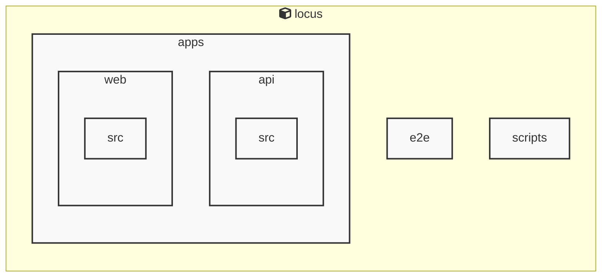

# Locus

<!-- MANUAL_START:notice -->
> このドキュメントは自動生成されています。そのため不正確な内容が含まれている可能性があります。
<!-- MANUAL_END:notice -->


<!-- MANUAL_START:description -->
Locus は「ローカルファースト」をモットーに設計された個人知識管理システムです。
ノートは Markdown で書き、すべてのデータ（Markdown ファイル、メタ情報、リンク構造）はユーザー自身が所有するローカルストレージに保存されます。そのためインターネット接続不要・外部サービスへの依存なしに知識を蓄積できるほか、プライバシーやデータセキュリティも担保します。
<!-- MANUAL_END:description -->
Locus は、ノートや RSS フィードを同一の知識空間に統合しつつ、**ローカルファースト**で動作する個人向け情報管理システムです。  
- **Markdown ノート**：マークダウン形式で書かれたメモはそのままテキストとして保存されますが、内部リンク（bidirectional links）を自動解析し、相互参照や関連性の可視化を行います。Obsidian や Logseq に似た編集体験を提供します。  
- **RSS フィード統合**：指定したフィード URL を定期的に取得し、HTML の内容は cheerio でパースしてマークダウンへ変換。結果として「記事ノート」が自動生成されるため、情報収集と知識構築を同時進行できます。  
- **統一された検索・ナビゲーション**：ファイルシステム上に散在する Markdown と RSS ノードは全て単一のインデックスで管理し、キーワードやタグによる高速検索が可能です。また、jszip を使ったアーカイブ機能により、一括エクスポート・バックアップも簡易的に実行できます。  
- **ローカルファースト**：すべてのデータはユーザー側のディレクトリ（例: `~/Locus/`）に保存され、ネットワーク接続がなくても完全動作します。必要に応じて Git などで同期させるだけです。  
- **CLI ベース**：シェルスクリプトと Node.js の組み合わせによって、ノートの生成・更新・検索をコマンドラインから行えるよう設計されています。`locus new "タイトル"` や `locus search keyword` など直感的な操作が可能です。  
- **拡張性**：TypeScript と JavaScript のコードベースにより、プラグインやカスタムスクリプトを簡単に追加できます。既存の RSS プロバイダだけでなく、自前のデータソース（API, JSON など）も取り込めます。  

**技術構成**

| 層 | 主な役割 |
|---|-----------|
| **UI/CLI** | シェルスクリプトと Node.js の `readline` インターフェイスを使用し、ユーザー操作を受け付ける。 |
| **コアエンジン** | Markdown パーサ（markdown-it など）＋ bidirectional link 検出ロジックでノート間の関係性を構築。 |
| **データ取得層** | `cheerio` を用いた RSS フィードパース、`jszip` によるアーカイブ処理。 |
| **ストレージ層** | ファイルベース（JSON/MD）＋ SQLite 等の軽量 DB でメタ情報を管理し、高速検索に対応。 |

Locus はオープンソース（MIT ライセンス）として GitHub 上で公開されており、誰でも自由にカスタマイズ・拡張できます。  
本プロジェクトは「**知識の一元化とローカルコントロールを両立したい人」向け」に設計されていますので、自分だけの情報エコシステムを構築したい開発者やリサーチャーに最適です。<!-- MANUAL_START:architecture -->

<!-- MANUAL_END:architecture -->


## Services

### locus
- **Type**: typescript
- **Description**: Locus is a local-first personal knowledge system that integrates Markdown notes, RSS feeds, and bidirectional links into a unified knowledge space.
- **Dependencies**: @biomejs/biome, @libsql/client, @playwright/test, @types/bun, @types/cheerio, @types/jszip, cheerio, jszip

## 使用技術

- TypeScript
- JavaScript
- Shell

## 依存関係

- **Node.js**: `package.json` を参照

## セットアップ


## 前提条件


- Node.js (推奨バージョン: 18以上)


## インストール


### JavaScript

```bash
# npmを使用する場合
npm install
```


## LLM環境のセットアップ

### APIを使用する場合

1. **APIキーの取得と設定**

   - OpenAI APIキーを取得: https://platform.openai.com/api-keys
   - 環境変数に設定: `export OPENAI_API_KEY=your-api-key-here`

2. **API使用時の注意事項**
   - APIレート制限に注意してください
   - コスト管理のために使用量を監視してください

### ローカルLLMを使用する場合

1. **ローカルLLMのインストール**

   - Ollamaをインストール: https://ollama.ai/
   - モデルをダウンロード: `ollama pull llama3`
   - サービスを起動: `ollama serve`

2. **ローカルLLM使用時の注意事項**
   - モデルが起動していることを確認してください
   - ローカルリソース（メモリ、CPU）を監視してください

## ビルドおよびテスト
### ビルド

```bash
npm run lint
npm run lint:fix
npm run format
npm run format:check
npm run check
# ... その他のコマンド
```
### テスト

```bash
npm test
```
## コマンド

プロジェクトで利用可能なスクリプト:

| コマンド | 説明 |
| --- | --- |
| `lint` | biome lint . |
| `lint:fix` | biome lint --write . |
| `format` | biome format --write . |
| `format:check` | biome format . |
| `check` | biome check . |
| `check:fix` | biome check --write . |
| `migrate` | bun run scripts/migrate.ts |
| `deploy:public-site` | bun run scripts/deploy-public-site.ts |
| `dev:api` | bun run apps/api/src/server.ts |
| `dev:web` | bun --cwd=apps/web run dev |
| `dev` | bunx concurrently --names 'API,WEB' --prefix-colors 'blue,green' 'bun run dev:api' 'bun run dev:web' |
| `test` | bun test apps packages |
| `test:api` | bun --cwd=apps/api test |
| `test:web` | bun --cwd=apps/web test |
| `test:coverage` | bun test --coverage apps/api/src apps/web/src |
| `test:coverage:api` | bun test --coverage apps/api/src |
| `test:coverage:web` | bun test --coverage apps/web/src |
| `test:e2e` | playwright test |
| `test:e2e:ui` | bash scripts/test-e2e-ui.sh |

---

*このREADME.mdは自動生成されています。最終更新: 2025-12-31 14:47:29*