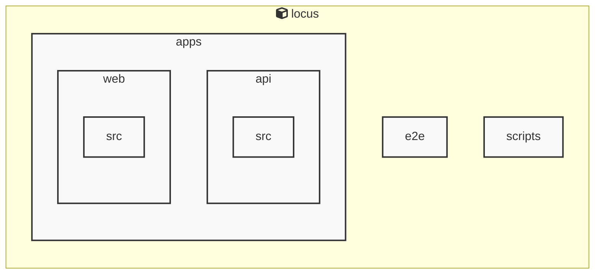

# Locus

<!-- MANUAL_START:notice -->
> このドキュメントは自動生成されています。そのため不正確な内容が含まれている可能性があります。
<!-- MANUAL_END:notice -->


<!-- MANUAL_START:description -->
Locus は「ローカルファースト」をモットーに設計された個人知識管理システムです。
ノートは Markdown で書き、すべてのデータ（Markdown ファイル、メタ情報、リンク構造）はユーザー自身が所有するローカルストレージに保存されます。そのためインターネット接続不要・外部サービスへの依存なしに知識を蓄積できるほか、プライバシーやデータセキュリティも担保します。
<!-- MANUAL_END:description -->
Locusは、ノートテイキングと情報収集を一つの統合された知識空間にまとめる**ローカルファースト型パーソナルナレッジシステム**です。  
- **Markdownベースのメモ管理**：フリーなエディタで作成した Markdown ファイルは自動的に Locus のデータ構造へ取り込まれ、リンクやタグを使って相互参照が可能になります。  
- **RSS フィード統合**：好きなフィードリーダーのように複数 RSS ソースから記事を取得し、自分専用のノートとして保存・検索できます。  
- **双方向リンク（Bidirectional Links）**：`[[ページ名]]` の記法で作成したリンクは、相手側にも自動的に参照が付与されるため、知識グラフを即座に可視化しながら関連情報へ飛びやすくなります。  
- **ローカル優先設計**：全データ（Markdown ファイル・RSS 記事・メタデータ）はユーザーのローカルディレクトリに保存され、外部サービスへのアップロードはオプションです。そのため、通信環境が不安定な場所や高いセキュリティ要件を持つ業務でも安心して利用できます。  
- **拡張性とカスタマイズ**：TypeScript で書かれたコアロジックは CLI ツールとしても、また VS Code のようなエディタに組み込むことが可能です。`locus init <dir>` コマンドでワークスペースを作成し、`.md`, `.rss.json`, `links.db` などのファイル構造を自動生成します。  
- **同期オプション**：Git リポジトリやクラウドストレージ（Dropbox, Google Drive 等）にデータをバックアップするだけでなく、複数端末間の手軽なシンクロもサポートしています。

## 開発・実行

```bash
# グローバルインストール (npm)
npm install -g locus

# 新規プロジェクト作成
locus init ~/my-locus-space

# RSS フィードを追加
echo "https://example.com/feed.xml" >> feeds.txt
locus fetch-feeds

# ノートのリンク編集例（VS Code で開く）
code .

# コマンドラインから検索・表示
locus search --tag todo
```

Locus はシンプルなコマンドセットと直感的な Markdown 記法を組み合わせ、知識管理に必要なすべての機能（ノート作成, フィード取り込み, 双方向リンク, 検索）をローカルで完結させます。開発者は TypeScript で拡張可能、ユーザーは日常的に手軽に情報を蓄積・再利用できるよう設計されています。<!-- MANUAL_START:architecture -->

<!-- MANUAL_END:architecture -->


## Services

### locus
- **Type**: typescript
- **Description**: Locus is a local-first personal knowledge system that integrates Markdown notes, RSS feeds, and bidirectional links into a unified knowledge space.
- **Dependencies**: @biomejs/biome, @libsql/client, @playwright/test, @types/bun

## 使用技術

- TypeScript
- JavaScript
- Shell

## 依存関係

- **Node.js**: `package.json` を参照

## セットアップ


## 前提条件


- Node.js (推奨バージョン: 18以上)


## インストール


### JavaScript

```bash
# npmを使用する場合
npm install
```


## LLM環境のセットアップ

### APIを使用する場合

1. **APIキーの取得と設定**

   - OpenAI APIキーを取得: https://platform.openai.com/api-keys
   - 環境変数に設定: `export OPENAI_API_KEY=your-api-key-here`

2. **API使用時の注意事項**
   - APIレート制限に注意してください
   - コスト管理のために使用量を監視してください

### ローカルLLMを使用する場合

1. **ローカルLLMのインストール**

   - Ollamaをインストール: https://ollama.ai/
   - モデルをダウンロード: `ollama pull llama3`
   - サービスを起動: `ollama serve`

2. **ローカルLLM使用時の注意事項**
   - モデルが起動していることを確認してください
   - ローカルリソース（メモリ、CPU）を監視してください

## ビルドおよびテスト
### ビルド

```bash
npm run lint
npm run lint:fix
npm run format
npm run format:check
npm run check
# ... その他のコマンド
```
### テスト

```bash
npm test
```
## コマンド

プロジェクトで利用可能なスクリプト:

| コマンド | 説明 |
| --- | --- |
| `lint` | biome lint . |
| `lint:fix` | biome lint --write . |
| `format` | biome format --write . |
| `format:check` | biome format . |
| `check` | biome check . |
| `check:fix` | biome check --write . |
| `migrate` | bun run scripts/migrate.ts |
| `dev:api` | bun run apps/api/src/server.ts |
| `dev:web` | bun --cwd=apps/web run dev |
| `dev` | bunx concurrently --names 'API,WEB' --prefix-colors 'blue,green' 'bun run dev:api' 'bun run dev:web' |
| `test` | bun test |
| `test:api` | bun --cwd=apps/api test |
| `test:web` | bun --cwd=apps/web test |
| `test:e2e` | playwright test |
| `test:e2e:ui` | bash scripts/test-e2e-ui.sh |

---

*このREADME.mdは自動生成されています。最終更新: 2025-12-25 11:34:12*