# Locus Architecture

```mermaid
graph TB
    %% Auto-generated architecture diagram

    subgraph locus [fa:fa-cube locus]
        direction TB
        subgraph at_locus_api [&#64;locus/api]
            direction TB
            subgraph at_locus_api_src [src]
                direction TB
                subgraph at_locus_api_src_db [db]
                    direction TB
                    at_locus_api_src_db_utils["utils"]:::moduleStyle
                end
                class at_locus_api_src_db moduleStyle
                at_locus_api_src_utils["utils"]:::moduleStyle
                at_locus_api_src_middleware["middleware"]:::moduleStyle
                at_locus_api_src_routes["routes"]:::moduleStyle
                subgraph at_locus_api_src_services [services]
                    direction TB
                    at_locus_api_src_services_utils["utils"]:::moduleStyle
                    at_locus_api_src_services_export["export"]:::moduleStyle
                    at_locus_api_src_services_llm["llm"]:::moduleStyle
                end
                class at_locus_api_src_services moduleStyle
            end
            class at_locus_api_src moduleStyle
        end
        class at_locus_api moduleStyle
        subgraph at_locus_web [&#64;locus/web]
            direction TB
            subgraph at_locus_web_src [src]
                direction TB
                subgraph at_locus_web_src_lib [lib]
                    direction TB
                    at_locus_web_src_lib_utils["utils"]:::moduleStyle
                    at_locus_web_src_lib_services["services"]:::moduleStyle
                    at_locus_web_src_lib_stores["stores"]:::moduleStyle
                    at_locus_web_src_lib_hooks["hooks"]:::moduleStyle
                    at_locus_web_src_lib_types["types"]:::moduleStyle
                    at_locus_web_src_lib_api["api"]:::moduleStyle
                    at_locus_web_src_lib_components["components"]:::moduleStyle
                end
                class at_locus_web_src_lib moduleStyle
            end
            class at_locus_web_src moduleStyle
        end
        class at_locus_web moduleStyle
        subgraph at_locus_shared [&#64;locus/shared]
            direction TB
            subgraph at_locus_shared_src [src]
                direction TB
                at_locus_shared_src_types["types"]:::moduleStyle
            end
            class at_locus_shared_src moduleStyle
        end
        class at_locus_shared moduleStyle
    end

    at_locus_api --> at_locus_shared
    at_locus_web --> at_locus_api
    at_locus_web --> at_locus_shared

    classDef pythonStyle fill:#3776ab,stroke:#ffd43b,stroke-width:2px,color:#fff
    classDef dockerStyle fill:#2496ed,stroke:#1d63ed,stroke-width:2px,color:#fff
    classDef dbStyle fill:#336791,stroke:#6b9cd6,stroke-width:2px,color:#fff
    classDef moduleStyle fill:#f9f9f9,stroke:#333,stroke-width:2px
```

## Services

### locus
- **Type**: typescript
- **Description**: Locus is a local-first personal knowledge system that integrates Markdown notes, RSS feeds, and bidirectional links into a unified knowledge space.
- **Dependencies**: &#64;biomejs/biome, &#64;libsql/client, &#64;playwright/test, &#64;types/bun, &#64;types/cheerio, &#64;types/jszip, cheerio, jszip

